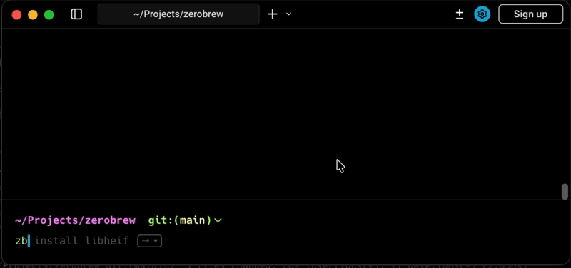

<div align="center">

<h2>brew</h2>

<p align="center">
  <a href="README.md">English</a> ·
  <strong>中文</strong>
</p>

[](https://github.com/i-nick/zerobrew/actions/workflows/ci.yml)
[](https://github.com/i-nick/zerobrew/releases)
[](https://discord.gg/ZaPYwm9zaw)
[](./LICENSE-MIT.md)
[](./LICENSE-APACHE.md)



<p><strong>brew 为 Apple 芯片 Mac 上的软件包管理带来了类似 uv 的架构。</strong></p>

</div>

## 安装 (Install)

```bash
curl -fsSL https://zerobrew.rs/install | bash
```

安装完成后，运行它打印的 `export` 命令（或重启终端）。

命令行工具为 `b`；同时会安装 `brew` 作为别名，因此 `brew install jq` 也可以使用。

## 快速开始 (Quick start)

```bash
b install jq                   # 安装单个软件包
b install wget git             # 安装多个软件包
b bundle                       # 从 Brewfile 安装
b bundle install -f myfile     # 从自定义文件安装
b bundle dump                  # 将已安装的软件包导出到 Brewfile
b bundle dump -f out --force   # 导出到自定义文件（覆盖）
b uninstall jq                 # 卸载单个软件包
b reset                        # 卸载所有内容
b gc                           # 垃圾回收未使用的存储条目
bx jq --version                # 在不链接的情况下运行
```

## 工作原理 (How it works)

- 用于去重的基于内容的寻址存储 (Content-addressable storage)
- 用于零开销复制的 APFS clonefiles
- 基于 Ruby formula DSL shim 的源码编译回退 (Source build fallback)

软件包元数据和 bottle 来自 Homebrew 项目；详见 [LICENSE-HOMEBREW](./LICENSE-HOMEBREW)。

## 项目状态 (Project status)

<div align="center">
  <a href="https://star-history.com/#i-nick/zerobrew&Date">
    <picture>
      <source media="(prefers-color-scheme: dark)" srcset="https://api.star-history.com/svg?repos=i-nick/zerobrew&type=Date&theme=dark" />
      
    </picture>
  </a>
</div>

- **状态：** 处于实验阶段，但对于许多常见的 formulas 已经非常有用。
- **反馈：** 如果遇到不兼容问题，请提出 issue 或 PR。
- **许可证：** 根据您的选择，在 [Apache 2.0](./LICENSE-APACHE.md) 或 [MIT](./LICENSE-MIT.md) 下获得双重许可。
